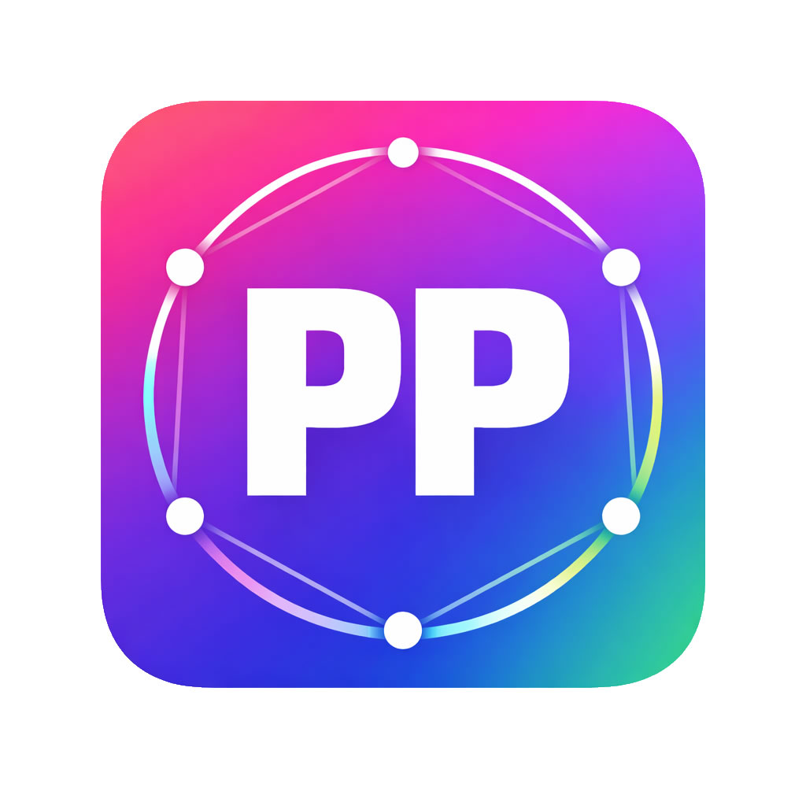

<p align="center">
  
</p>

<h1 align="center">PPToken</h1>

<p align="center">
  The most powerful companion app for <a href="https://github.com/openai/codex">OpenAI Codex</a>.<br/>
  Multi-account rotation, session tree management, smart model routing — all in one native desktop app.
</p>

<p align="center">
  <b>English</b> | <a href="README.md">简体中文</a>
</p>

<p align="center">
  <a href="#highlights">Highlights</a> &bull;
  <a href="#account-management">Accounts</a> &bull;
  <a href="#session-management">Sessions</a> &bull;
  <a href="#smart-router">Smart Router</a> &bull;
  <a href="#open-source-modules">Open Source</a> &bull;
  <a href="#tech-stack">Tech Stack</a> &bull;
  <a href="#getting-started">Getting Started</a> &bull;
  <a href="#license">License</a>
</p>

---

## Highlights

PPToken is **not** a fork or wrapper of Codex — it is a standalone native desktop app that extends Codex with capabilities the official client does not provide:

- **Multi-Account Rotation** — Manage unlimited Codex accounts, monitor real-time quota, and auto-switch when rate limits hit.
- **Session Tree Management** — Visualize all Codex threads as a project-grouped tree, batch-delete, and recover lost/orphan sessions.
- **Smart Model Router** — Inject third-party models into Codex's model menu to coexist with official models (GPT, Claude, DeepSeek, local models, etc.).
- **MCP & Skills** — Full lifecycle management for MCP servers and Codex skill packages.
- **Custom Instructions** — Template-based instruction injection with preview, apply, rollback, and history tracking.
- **Cross-Platform** — Native macOS and Windows support via Tauri 2.

---

## Account Management

Manage multiple Codex accounts from a single interface — monitor quota, auto-rotate, and never hit a rate limit again.

### Multi-Account Operations
- Add, switch, delete, and log out accounts with one click.
- Search across email, alias, account name, workspace, and profile.
- Filter by plan type: Free / Plus / Pro / Team / Enterprise / Edu.
- Copy email or account key from account detail view.

### Real-Time Quota Monitoring
- Dual rate-limit windows (5-hour and weekly) displayed as percentage bars with reset countdown.
- Configurable auto-refresh interval (30s ~ 5min).
- Full enrichment refresh: quota, workspace metadata, subscription status, and token health for all accounts at once.
- API unreachable overlay with proxy configuration prompt when connectivity is lost.

### Token Health
- Inline status badges for token issues: missing refresh token, rejected refresh, temporary failure, etc.
- Detailed status card with server-side notes and remaining time.
- Automatic renewal and writeback on success.

### Automatic Account Rotation
- Dual-threshold triggers: independent thresholds for 5-hour and weekly windows.
- Smart candidate selection: picks the account with the highest combined quota.
- In-app confirmation prompt with switch + restart, or dismiss/snooze.

### Backup & Restore
- Export all accounts to a portable file; import with preview showing which accounts will be added, overwritten, or skipped.

### API Proxy
- Direct connection or manual proxy URL for remote API requests.
- One-click system proxy detection and connectivity test.

---

## Session Management

Visualize, manage, and recover all Codex conversation threads — something the official Codex client doesn't expose.

### Thread Tree View
- Project-grouped layout with parent-child thread tree, sorted by last update time.
- Metadata display: thread name, sub-thread count, file size, and status badges.

### Batch Operations
- Multi-select individual threads, entire branches (with descendants), or full project groups.
- Batch delete with confirmation and automatic analytics refresh.

### Lost Thread Recovery
- Scan for threads that disappeared from the Codex UI.
- Per-project recovery badges showing recoverable count.
- Batch recover selected lost threads (requires Codex to be closed).
- Orphan detection: threads whose parent no longer exists are flagged with a summary banner.
- Missing project directory detection with cleanup recommendations.

### Session Analytics
- Stats overview: total threads, total storage, active days, and average threads per day.
- Trend charts: session count, token usage, tool invocations, and code changes by day/week/month.

---

## Smart Router

Inject third-party models into Codex's model menu to coexist with official models — no CLI flags, no manual config editing.

### Provider Management
- Add, edit, delete, and test unlimited model providers.
- Support for OpenAI-compatible, Anthropic, and other protocols.
- API keys stored securely in the system keychain.
- Custom HTTP headers per provider; per-provider network mode (system proxy or direct).
- Fetch available models from the provider's API for easy selection.
- Built-in presets for popular providers — one-click import, just fill in your API key.

### Health Check
- Live connectivity test with latency measurement for saved providers.
- Status badges: healthy / high latency / unreachable / misconfigured.
- Draft test for unsaved configurations.

### One-Click Router Toggle
- Enable or disable the router with a single click; Codex restarts automatically with all changes applied.
- All existing threads remain visible in Codex after toggling — no conversation loss.
- User profile conflict detection with clear diagnostic guidance.

### Diagnostics & Repair
- Aggregated diagnostic panel covering all router-related states.
- Per-issue fix actions, or fix-all in one click.

### Backup & Restore
- Export all provider configurations to a file, optionally including API keys.
- Additive import with duplicate detection.

---

## Open Source Modules

The following modules are fully included in this repository:

- **MCP Server Management** — Add, edit, enable/disable MCP servers that extend Codex capabilities.
- **Skills Lifecycle** — Import, remove, backup, and restore skill packages.
- **Custom Instructions** — Template library, content preview with diff, apply/rollback/clear with full history tracking.
- **System Maintenance** — Registry rebuild, clean, diagnose, daemon management.
- **Settings** — Theme, language, refresh interval, proxy, update management.
- **Auto Updater** — Built-in OTA update with Ed25519 signature verification.
- **40+ UI Components** — A complete shadcn/ui-based design system with custom extensions.

> **Note:** Account Management, Session Management, and Smart Router are proprietary modules not included in this open-source release.

---

## Tech Stack

| Layer | Technology |
|-------|-----------|
| App Shell | [Tauri 2](https://v2.tauri.app/) |
| Frontend | [React 18](https://react.dev/) + TypeScript + [Vite 6](https://vite.dev/) |
| Styling | [Tailwind CSS 3](https://tailwindcss.com/) + [shadcn/ui](https://ui.shadcn.com/) |
| State | [TanStack Query](https://tanstack.com/query) |
| Native Layer | [Rust](https://www.rust-lang.org/) (Tauri commands) |
| i18n | [i18next](https://www.i18next.com/) + react-i18next |

## Getting Started

### Prerequisites

- [Node.js](https://nodejs.org/) >= 18
- [pnpm](https://pnpm.io/) >= 8
- [Rust](https://rustup.rs/) >= 1.77
- Tauri 2 system dependencies — see [Tauri Prerequisites](https://v2.tauri.app/start/prerequisites/)

### Development

```bash
git clone https://github.com/xiaokelongxia/PPToken.git
cd PPToken
pnpm install
pnpm tauri dev
```

The dev server starts at `http://localhost:3123` and the Tauri window loads it automatically.

### Build

```bash
pnpm tauri build
```

Output: native `.app` (macOS) or `.exe` installer (Windows) in `src-tauri/target/release/bundle/`.

### Cross-Platform Artifacts

Pushing to `main` or running the GitHub Actions workflow manually builds:

- `PPToken-macOS`: universal macOS `.app`
- `PPToken-Windows`: Windows `.exe` installer

## Acknowledgments

- [Tauri](https://tauri.app/) — Native cross-platform apps with web frontends.
- [shadcn/ui](https://ui.shadcn.com/) — Beautiful, accessible component primitives.
- [OpenAI Codex](https://github.com/openai/codex) — The CLI tool this companion app is built around.

## License

This project is licensed under the [Apache License 2.0](LICENSE).

```
Copyright 2025-2026 PPToken

Licensed under the Apache License, Version 2.0 (the "License");
you may not use this file except in compliance with the License.
You may obtain a copy of the License at

    http://www.apache.org/licenses/LICENSE-2.0
```
