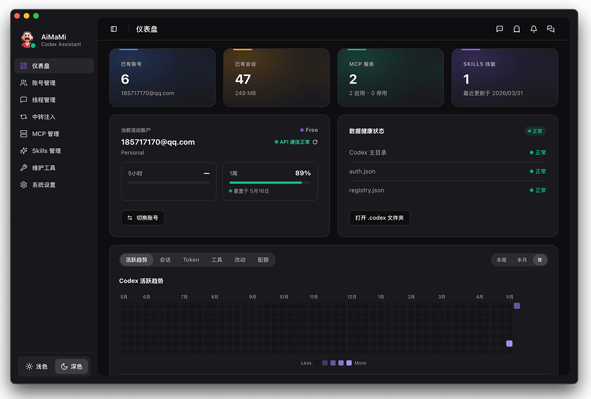

<p align="center">
  
</p>

<h1 align="center">PPToken</h1>

<p align="center">
  <a href="https://github.com/openai/codex">OpenAI Codex</a> 最强外挂。<br/>
  多账号轮换、会话树管理、智能模型路由 —— 一个原生桌面应用全搞定。
</p>

<p align="center">
  <a href="README-en.md">English</a> | <b>简体中文</b>
</p>

<p align="center">
  <a href="#核心亮点">核心亮点</a> &bull;
  <a href="#账号管理">账号管理</a> &bull;
  <a href="#线程管理">线程管理</a> &bull;
  <a href="#智能路由">智能路由</a> &bull;
  <a href="#开源模块">开源模块</a> &bull;
  <a href="#技术栈">技术栈</a> &bull;
  <a href="#快速开始">快速开始</a> &bull;
  <a href="#许可证">许可证</a>
</p>

---

## 核心亮点

PPToken **不是** Codex 的 fork 或套壳 —— 它是一个独立的原生桌面应用，为 Codex 扩展官方客户端不具备的能力：

- **多账号轮换** —— 管理无限量 Codex 账号，实时监控额度，额度耗尽自动切换。
- **会话树管理** —— 以项目分组的树形结构可视化所有 Codex 线程，支持批量删除与丢失线程恢复。
- **中转模型注入** —— 在 Codex 的模型菜单中注入第三方模型与官方模型共存（GPT、Claude、DeepSeek、本地模型等）。
- **MCP & Skills** —— MCP 服务器与技能包的完整生命周期管理。
- **自定义指令** —— 基于模板的指令注入，支持预览、应用、回滚和历史追踪。
- **跨平台** —— 基于 Tauri 2 原生支持 macOS 和 Windows。

---

<p align="center">
  
</p>
<p align="center">
  
</p>


## 账号管理

在一个界面中管理所有 Codex 账号 —— 实时监控额度、自动轮换，彻底告别限速。

### 多账号操作
- 一键添加、切换、删除、登出账号。
- 跨邮箱、别名、账户名、工作区、昵称多字段搜索。
- 按计划类型筛选：Free / Plus / Pro / Team / Enterprise / Edu。
- 详情页可复制邮箱和账号密钥。

### 实时额度监控
- 双时间窗口（5 小时 + 周度）以百分比进度条展示，附带重置倒计时。
- 可配置自动刷新间隔（30 秒 ~ 5 分钟）。
- 全量增强刷新：一次性拉取所有账号的额度、工作区元数据、订阅状态、令牌健康。
- API 不可达时自动遮罩陈旧数据并引导配置代理。

### 令牌健康
- 行内状态徽章展示令牌问题：缺少 refresh token、refresh 被拒、临时故障等。
- 详情状态卡含服务端附言和剩余时间。
- 续期成功自动写回。

### 自动账号轮换
- 双阈值触发：5 小时窗口和周度窗口各自独立设置。
- 智能候选选择：自动选出额度最充裕的账号。
- 应用内弹出待切换通知，确认后切换并重启 Codex，或忽略/暂停。

### 备份与恢复
- 导出所有账号为可移植文件；导入时预览显示哪些账号将被新增、覆盖或跳过。

### API 代理
- 直连或手动代理 URL，仅作用于远程 API 请求。
- 一键检测系统代理、一键测试连通性。

---

## 线程管理

可视化、管理和恢复所有 Codex 对话线程 —— 官方 Codex 客户端从未暴露的能力。

### 线程树视图
- 按项目分组，父子线程折叠展开，按更新时间排序。
- 展示线程名称、子线程数量、文件大小和状态徽章。

### 批量操作
- 多选单条线程、整个分支（含所有后代）、或整个项目组。
- 批量删除，完成后自动刷新分析数据。

### 丢失线程恢复
- 扫描从 Codex UI 中消失的线程。
- 项目级恢复徽章，展示可恢复数量。
- 批量恢复选中的丢失线程（需先关闭 Codex）。
- 孤儿检测：父线程不存在的线程被标记并统计。
- 缺失项目目录检测，附清理建议。

### 会话分析
- 统计概览：总线程数、总存储大小、活跃天数、日均线程数。
- 趋势图表：按日/周/月展示会话数、Token 用量、工具调用、代码变更。

---

## 智能路由

在 Codex 的模型菜单中注入第三方模型与官方模型共存 —— 无需 CLI 参数，无需手动编辑配置。

### Provider 管理
- 添加、编辑、删除、测试无限数量的模型提供商。
- 支持 OpenAI 兼容、Anthropic 等多种协议。
- API Key 安全存储在系统钥匙串。
- 每个 Provider 可自定义请求头和网络模式（跟随系统代理或直连）。
- 从 Provider API 拉取可用模型列表，便于选择。
- 内置热门 Provider 预设，一键导入只需填 API Key。

### 健康检查
- 实时连通性测试，测量延迟。
- 状态徽章：正常 / 高延迟 / 不可达 / 配置错误。
- 支持未保存配置的草稿测试。

### 一键路由开关
- 一键启用或禁用路由，Codex 自动重启并应用所有变更。
- 开关后所有已有线程在 Codex 中保持可见，不丢失任何对话。
- 用户配置冲突时提供清晰的诊断指引。

### 诊断与修复
- 聚合诊断面板，覆盖所有路由相关状态。
- 逐项修复或一键全部修复。

### 备份与恢复
- 导出所有 Provider 配置，可选是否包含 API Key。
- 追加模式导入，自动检测重复。

---

## 开源模块

以下模块完整包含在此仓库中：

- **MCP 服务器管理** —— 添加、编辑、启用/禁用扩展 Codex 能力的 MCP 服务器。
- **技能包生命周期** —— 导入、移除、备份、恢复技能包。
- **自定义指令** —— 模板库、带 diff 的内容预览、应用/回滚/清除及完整历史追踪。
- **系统维护** —— 注册表重建、清理、诊断、守护进程管理。
- **设置** —— 主题、语言、刷新频率、代理、更新管理。
- **自动更新** —— 内置 OTA 更新，Ed25519 签名校验。
- **40+ UI 组件** —— 基于 shadcn/ui 的完整设计系统及自定义扩展。

> **注意：** 账号管理、线程管理和智能路由是私有模块，未包含在此开源发布中。

---

## 技术栈

| 层 | 技术 |
|---|------|
| 应用壳 | [Tauri 2](https://v2.tauri.app/) |
| 前端 | [React 18](https://react.dev/) + TypeScript + [Vite 6](https://vite.dev/) |
| 样式 | [Tailwind CSS 3](https://tailwindcss.com/) + [shadcn/ui](https://ui.shadcn.com/) |
| 状态管理 | [TanStack Query](https://tanstack.com/query) |
| 原生层 | [Rust](https://www.rust-lang.org/)（Tauri commands） |
| 国际化 | [i18next](https://www.i18next.com/) + react-i18next |

## 快速开始

### 前置条件

- [Node.js](https://nodejs.org/) >= 18
- [pnpm](https://pnpm.io/) >= 8
- [Rust](https://rustup.rs/) >= 1.77
- Tauri 2 系统依赖 — 参见 [Tauri Prerequisites](https://v2.tauri.app/start/prerequisites/)

### 开发

```bash
git clone https://github.com/xiaokelongxia/PPToken.git
cd PPToken
pnpm install
pnpm tauri dev
```

开发服务器启动在 `http://localhost:3123`，Tauri 窗口自动加载。

### 构建

```bash
pnpm tauri build
```

产物：macOS 原生 `.app` 或 Windows `.exe` 安装器，位于 `src-tauri/target/release/bundle/`。

### 跨平台产物

推送到 `main` 分支或手动运行 GitHub Actions 后，仓库会自动构建：

- `PPToken-macOS`：macOS universal `.app`
- `PPToken-Windows`：Windows `.exe` 安装器

## 致谢

- [Tauri](https://tauri.app/) — 让 Web 前端构建原生跨平台应用成为现实。
- [shadcn/ui](https://ui.shadcn.com/) — 精美、无障碍的组件原语。
- [OpenAI Codex](https://github.com/openai/codex) — 本应用围绕的 CLI 工具。

## 许可证

本项目采用 [Apache License 2.0](LICENSE) 许可。

```
Copyright 2025-2026 PPToken

Licensed under the Apache License, Version 2.0 (the "License");
you may not use this file except in compliance with the License.
You may obtain a copy of the License at

    http://www.apache.org/licenses/LICENSE-2.0
```
